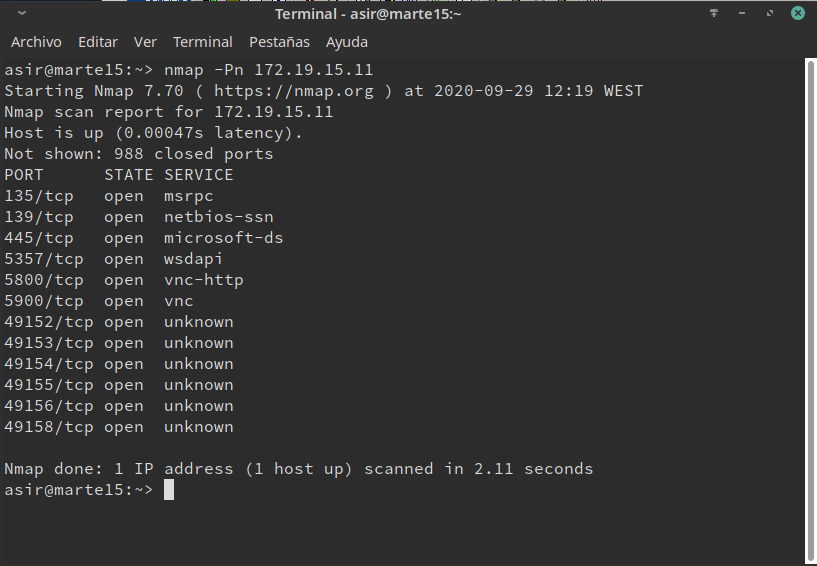

# VNC - WINDOWS

  Ejecutamos el comando nmap -Pn 172.19.15.11, desde la máquina real GNU/Linux para comprobar que los servicios son visibles desde fuera de la máquina VNC-SERVER.

  

2.1 Comprobaciones finales

    Conectamos desde Window Master hacia el Windows Slave.

    Conectamos desde GNU/Linux Master hacia el Windows Slave.

    Ejecutamos el comando netstat -n para ver las conexiones VNC con el cliente.

