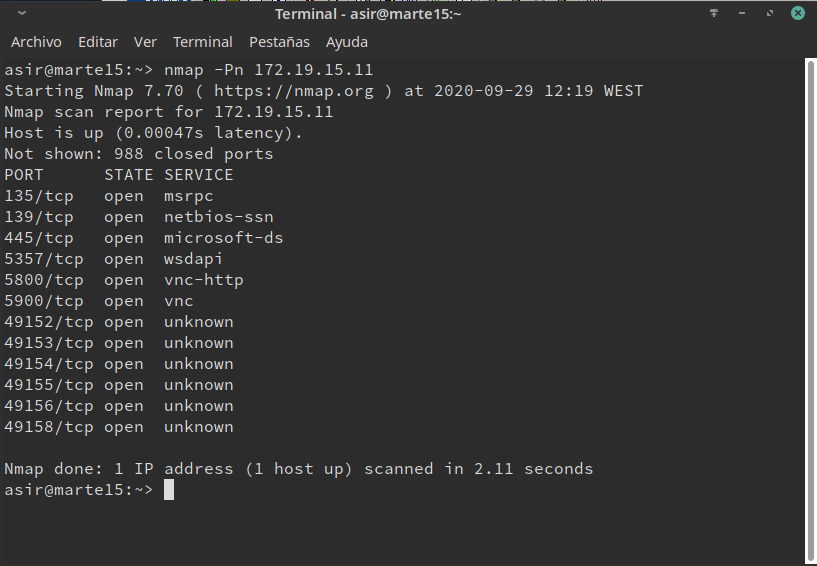
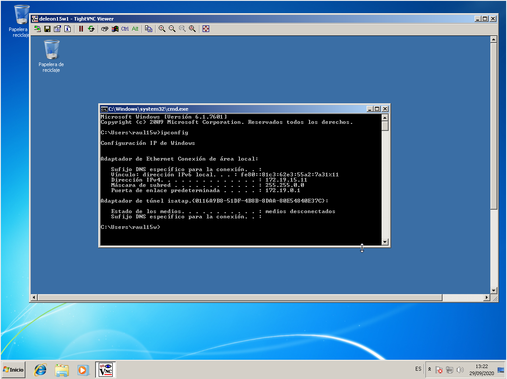
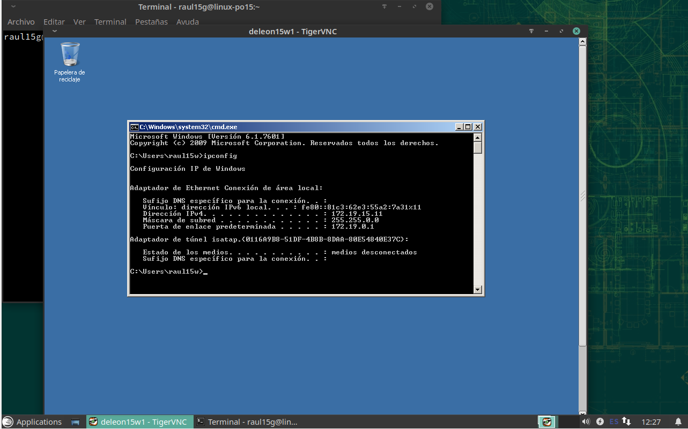

# VNC - WINDOWS

  *Ejecutamos el comando nmap -Pn 172.19.15.11, desde la máquina real GNU/Linux para comprobar que los servicios son visibles desde fuera de la máquina VNC-SERVER.*

  

2.1 Comprobaciones finales

    Conectar desde Window Master hacia el Windows Slave.

    

    Conectar desde GNU/Linux Master hacia el Windows Slave.

    

    Ir al servidor VNC y usar el comando netstat -n para ver las conexiones VNC con el cliente.

    
