# SSH

### 1.1 Servidor SSH
Comprobamos que la maquina virtual se ha configurado correctamente con los siguientes comandos:

- ip a               
- ip route           
- ping 8.8.4.4 -i 2  
- host www.nba.com   
- ping client15g     
- ping client15w     
- lsblk              
- blkid              

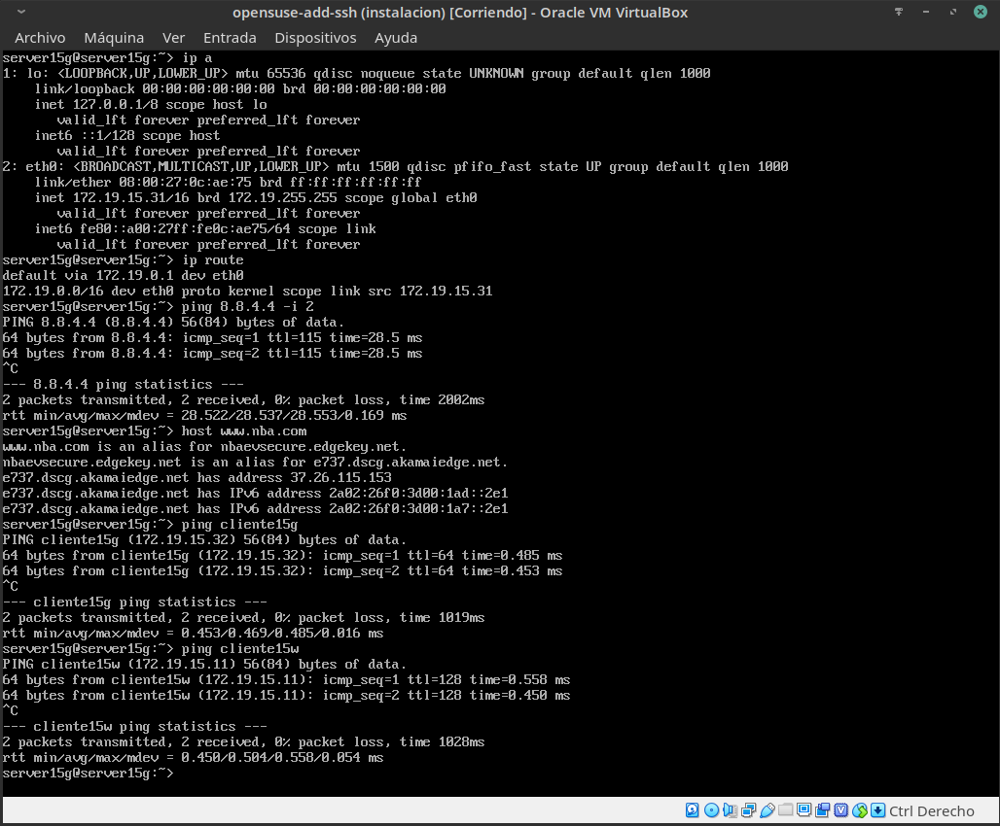
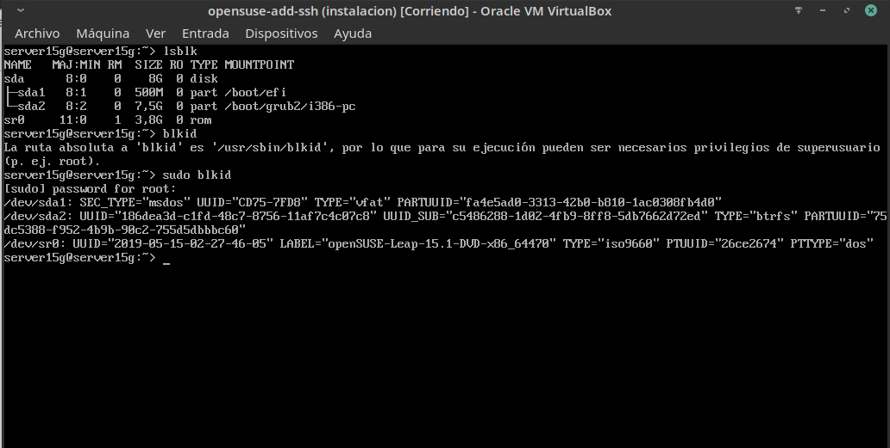

### 2.2 Primera conexión SSH GNU/Linux
Añadimos al archivo _/etc/hosts_ los equipos server15g y cliente15w.
Una vez añadidos comprobamos que ambos tienen conexión entre si:

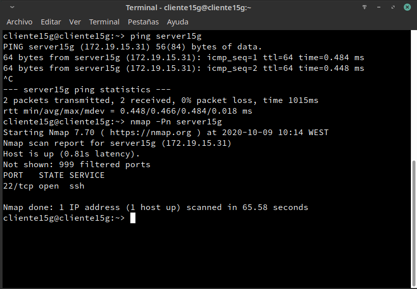

Una vez verificado que tenemos conexión con el servidor, nos conectaremos por SSH desde la maquina cliente hasta el servidor con el comando _ssh deleon1@server15g_:

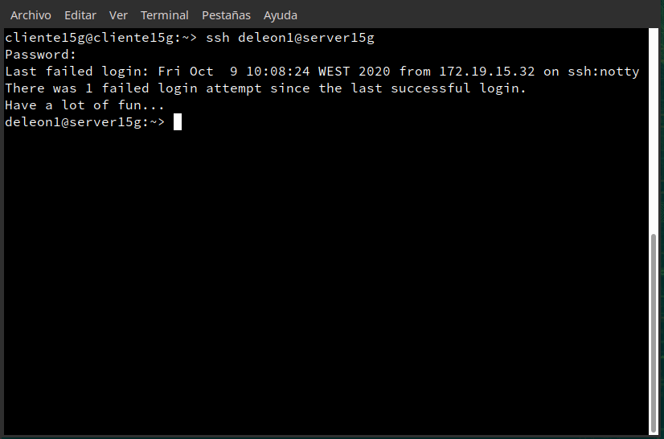

### 3.2 Comprobar cambio clave servidor SSH
Ahora si intentamos conectarnos desde el cliente hasta el servidor nos aparecerá un error:

Si generamos nuevas keygen podremos acceder al servidor:

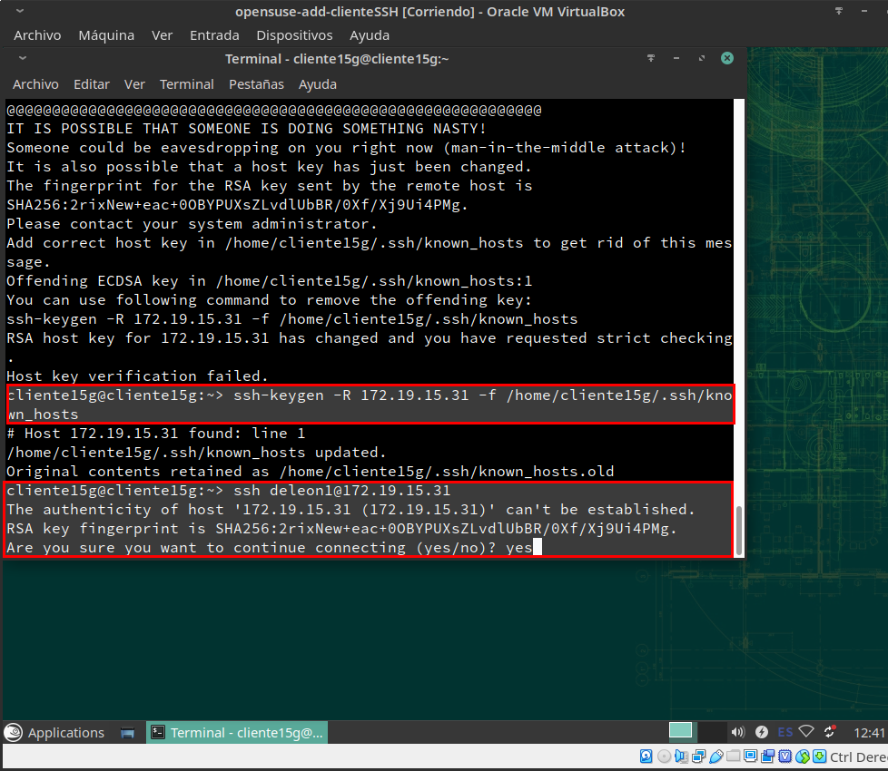

Debería pasar lo mismo con Windows, pero en este caso ha ocurrido un fallo y nos ha dejado acceder con un nuevo ssh-rsa:

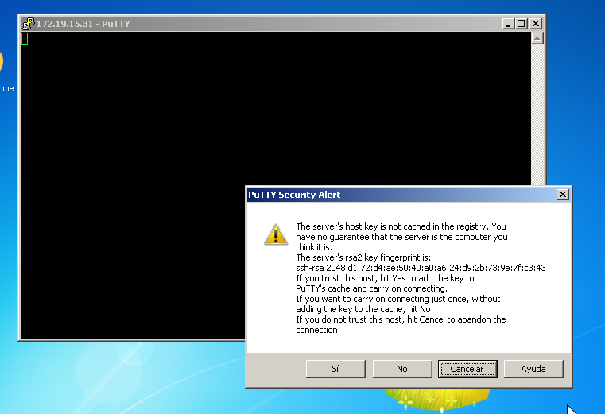

### 5 Autenticación mediante clave pública

Lo primero será iniciar sesión con nuestro el usuario raul de la máquina cliente15g y generar un nuevo para del claves con el comando _ssh-keygen -t rsa_ en la siguiente ubicación

- /home/raul/.ssh/id_rsa
- /home/raul/.ssh/id_rsa.pub

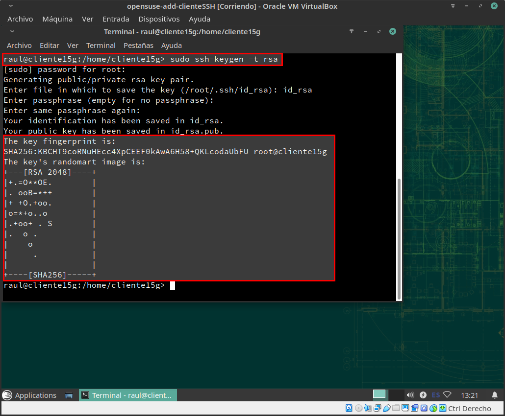

Ahora vamos a copiar la clave pública (id_rsa.pub), al fichero "authorized_keys" del usuario remoto deleon4 que está en el servidor.
Hay varias formas de hacerlo.
Para ello usaremos el comando _ssh-copy-id deleon4@server15g_:

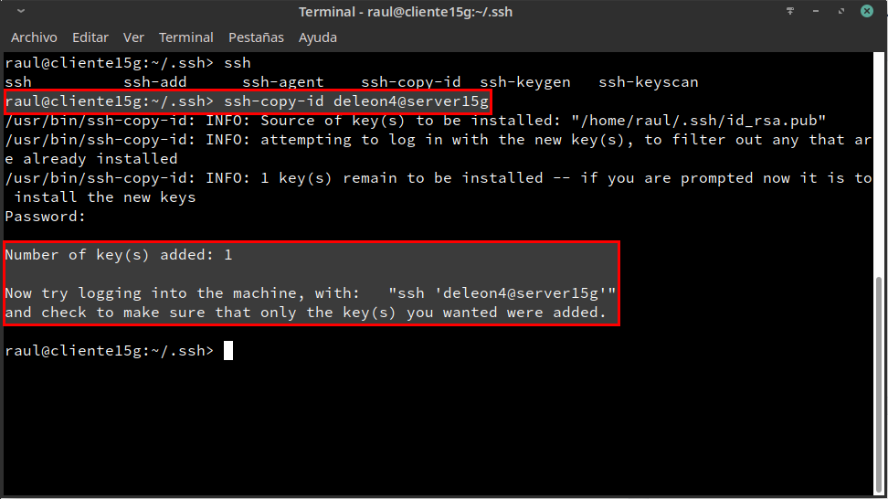

Y si ahora accedemos del desde el usuario _raul_ desde el cliente hasta el usuario _deleon4_ del servidor, no nos pedirá la contraseña de acceso:

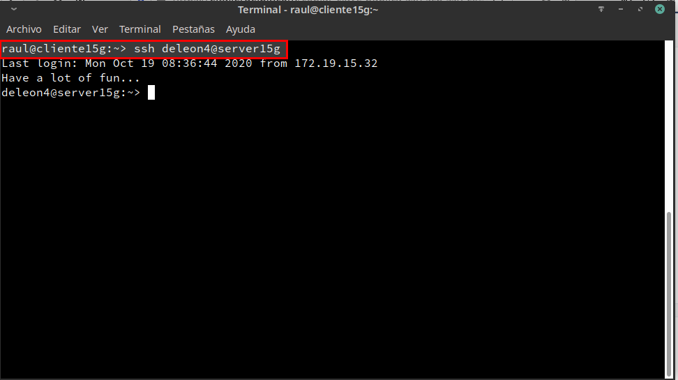

Para comprobar que esta condición solo se ha establecido en el usuario _raul_ del cliente, intentamos acceder desde el usuario _raul_ de _Windows_:

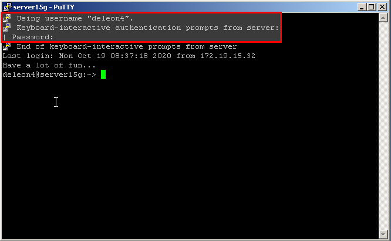

Como podemos observar, nos pide la contraseña de acceso.

### 6 Uso de SSH como túnel para X
A continuación, instalaremos en el servidor una aplicación de entorno grafico que no este en los clientes, en este caso usaremos geany. Para ello será necesario configurar la opción X11Forwarding a yes del fichero _/etc/ssh/sshd_config_:

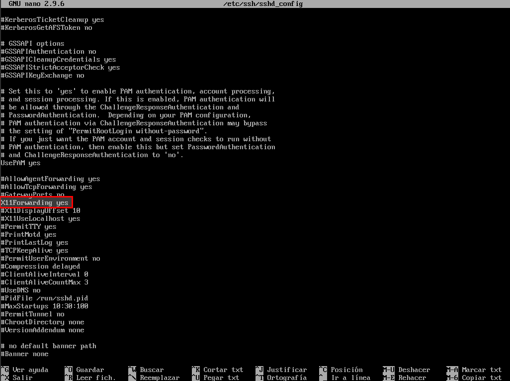

Una vez hecho esto, nos dirigimos al cliente y nos conectamos por ssh pero añadiremos un -X para que puede ejecutar aplicaciones graficas. _ssh -X deleon1@server15g_:

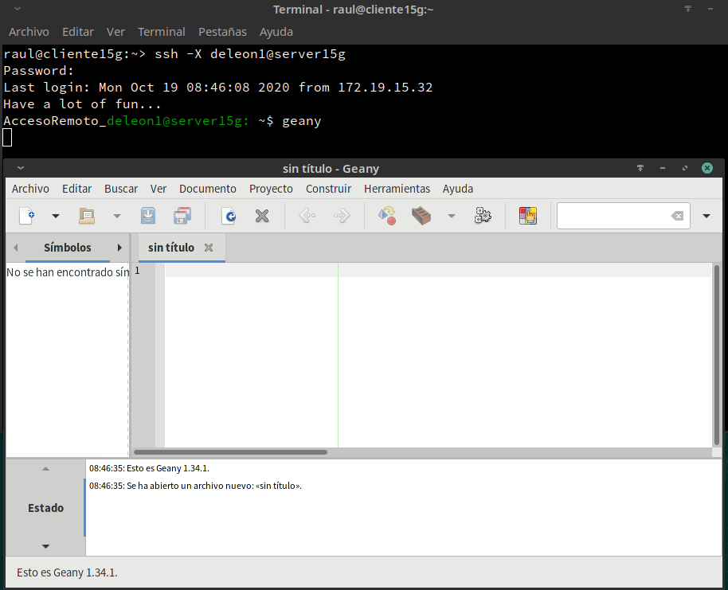

### 7 Aplicaciones Windows Nativas

Lo primero será instalar Wine en el servidor y mediante ssh conectarnos con el cliente y ejecutar el block de notas que viene con la aplicación de Wine. _wine notepad_:

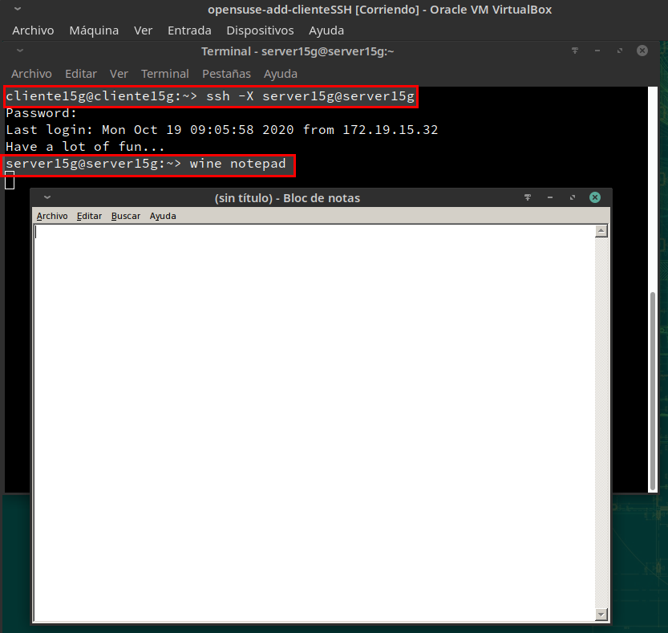

### 8.1 Restricción sobre un usuario

Para finalizar la practica, añadiremos restricción sobre los usuarios del cliente. Para ello usaremos el usuario deleon2 del servidor y modificaremos el archivo _/etc/ssh/sshd_config_ y estableceremos las restricciones a los usuarios raul y cliente15g:

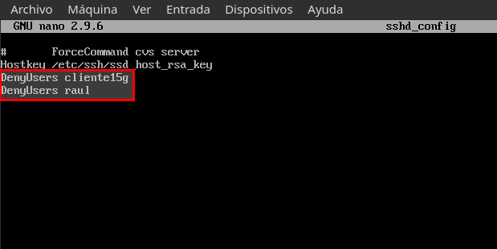

Para verificar que hemos hecho todo correctamente, ejecutamos el comando _/usr/sbin/sshd -t; echo $?_ y la respuesta debería ser 0, si nos apareciera un 1, el fichero estaría configurado de forma incorrecta:

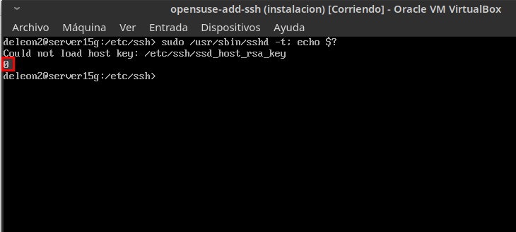

Y por ultimo si intentamos conectarnos por ssh al usuario _deleon2_ desde la maquina cliente con el usuario _raul_, no nos dejará:

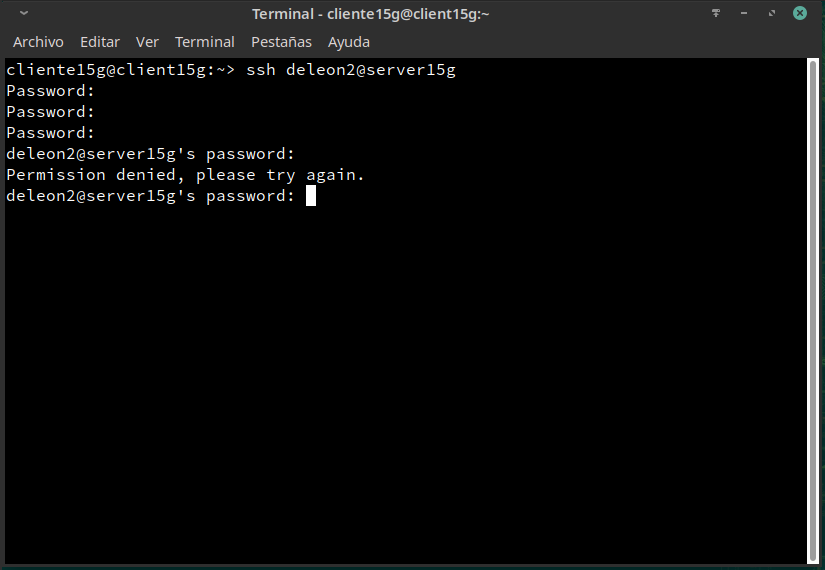
