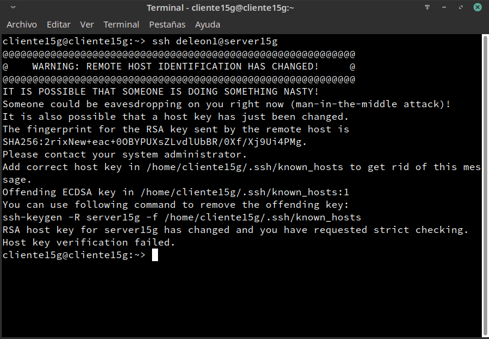

# SSH

### 1.1 Servidor SSH
Comprobamos que la maquina virtual se ha configurado correctamente con los siguientes comandos:

- ip a               
- ip route           
- ping 8.8.4.4 -i 2  
- host www.nba.com   
- ping clientXXg     
- ping clientXXw     
- lsblk              
- blkid              

### 2.2 Primera conexión SSH GNU/Linux
Añadimos al archivo _/etc/hosts_ los equipos server15g y cliente15w.
Una vez añadidos comprobamos que ambos tienen conexion entre si:

Una vez verificado que tenemos conexion con el servidor, nos conectaremos por SSH desde la maquina cliente hasta el servidor con el comando _ssh deleon1@server15g_:

### 3.2 Comprobar cambio clave servidor SSH
Ahora si intentamos conectarnos desde el cliente hasta el servidor nos aparecera un error:

Si generamos nuevas keygen podremos acceder al servidor:

Deberia pasar lo mismo con Windows, pero en este caso ha ocurrido un fallo y nos ha dejado acceder con un nuevo ssh-rsa:

### 5 Autenticación mediante clave pública

Lo primero será iniciar sesión con nuestro el usuario raul de la máquina cliente15g y generar un nuevo para del claves con el comando _ssh-keygen -t rsa_ en la siguiente ubicacion:

- /home/raul/.ssh/id_rsa
- /home/raul/.ssh/id_rsa.pub

Ahora vamos a copiar la clave pública (id_rsa.pub), al fichero "authorized_keys" del usuario remoto deleon4 que está en el servidor.
Hay varias formas de hacerlo.
Para ello usaremos el comando _ssh-copy-id deleon4@server15g_:

Y si ahora accedemos del desde el usuario _raul_ desde el cliente hasta el usuario _deleon4_ del servidor, no nos pedirá la contraseña de acceso:

Para comprobar que esta condicion solo se ha establecido en el usuario _raul_ del cliente, intentamos acceder desde el usuario _raul_ de _Windows_:

Como podemos observar, nos pide la contraseña de acceso.

(6 ) Uso de SSH como túnel para X			
(8.1) Restricción sobre un usuario
(9) Servidor SSH en Windows
