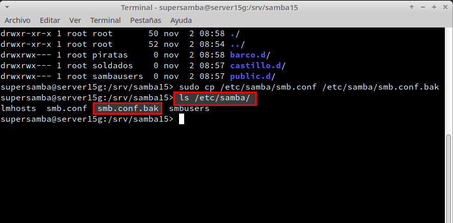
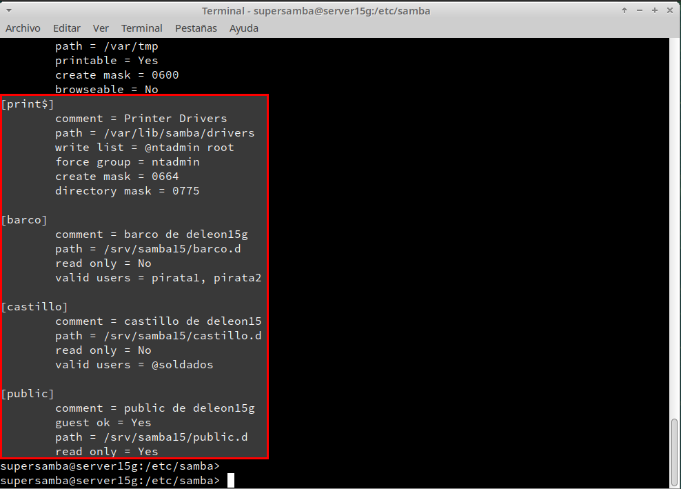
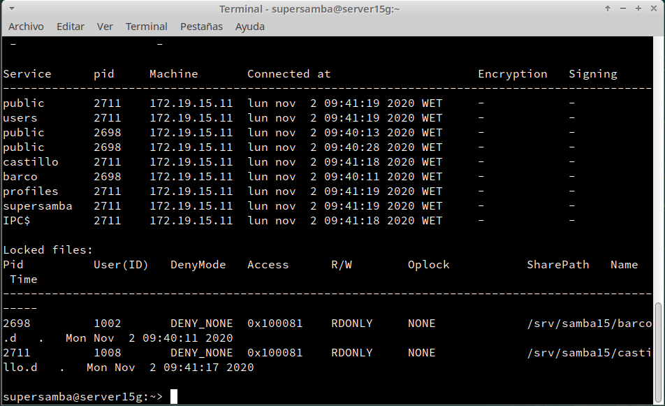
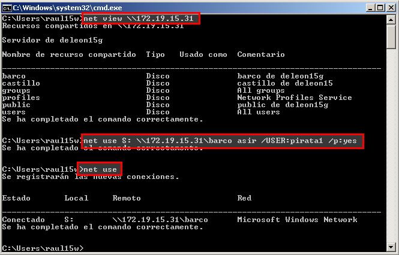
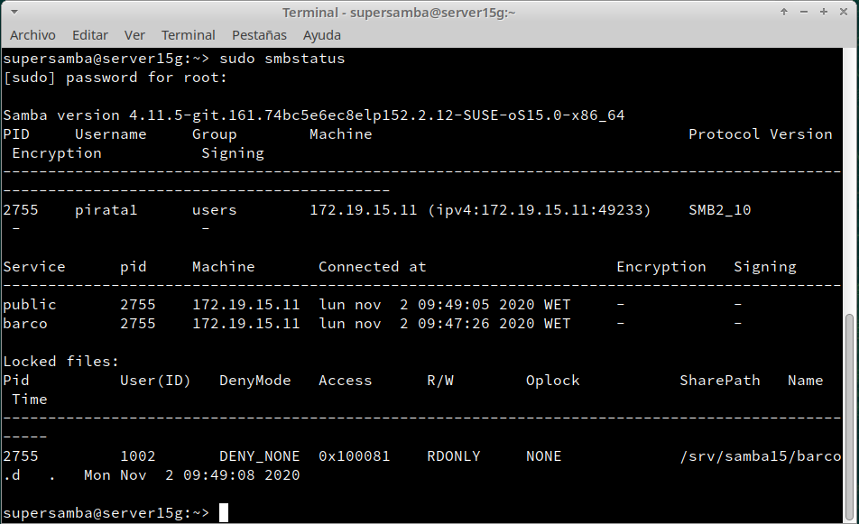
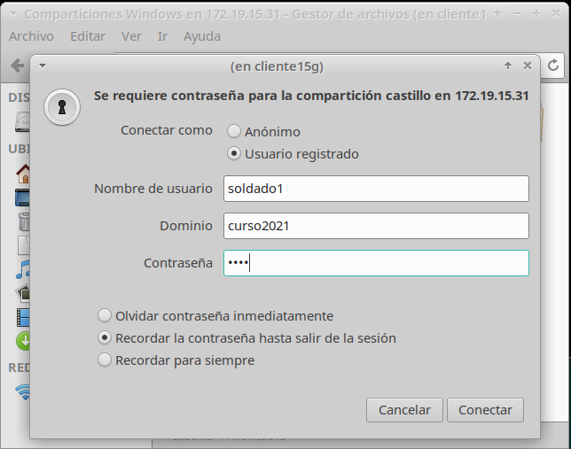
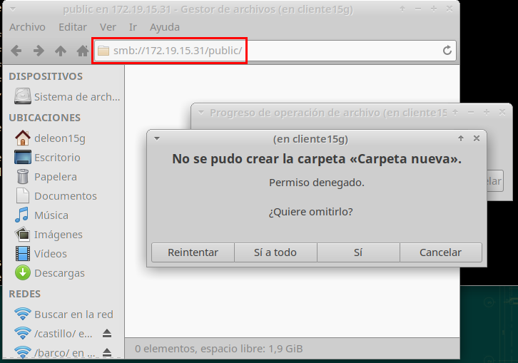
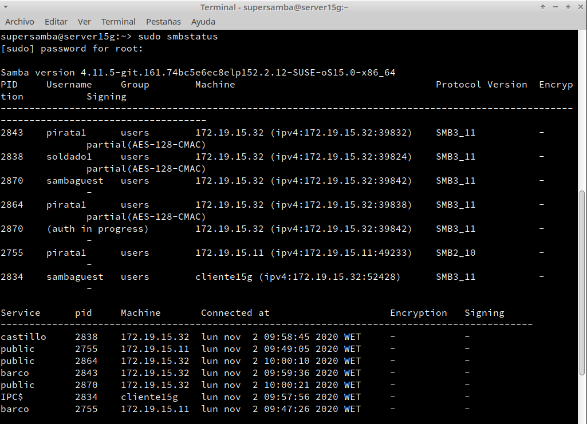
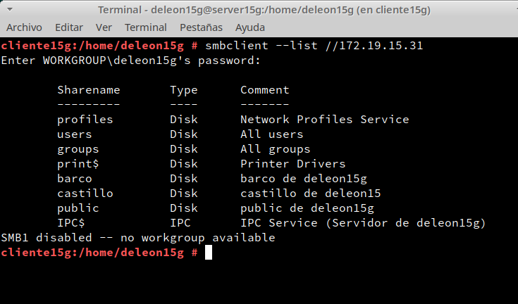

# (1.4 y 1.5) Fichero smb.conf

Antes de configurar el servidor Samba, haremos una copia de seguridad en archivo de configuración con el comando _cp /etc/samba/smb.conf /etc/samba/smb.conf.bak_

Lo siguiente será dirigirse a yast y cambiar la configuración de **Samba Server**. En la pestaña _Inicio_, establecemos _Iniciar durante el arranque_ y habilitaremos el _Puerto abierto en el cortafuegos_:

A continuación vamos a configurar los recursos compartidos de red en el servidor.

Modificaremos los siguientes parámetros: global, public, barco, y castillo con la siguiente configuración:

- **public** será un recurso compartido accesible para todos los usuarios en modo lectura.

- **barco** recurso compartido de red de lectura/escritura para todos los piratas.

- **castillo** recurso compartido de red de lectura/escritura para todos los soldados.

Podemos modificar la configuración editaremos directamente el fichero _/etc/samba/smb.conf_:

Para finalizar la configuración ejecutaremos los comandos _testparm_ y _more /etc/samba/smb.conf_ para verificar que todo esta correcto:

# (2.1 y 2.2) Conexión SMB desde Windows

Accedemos desde un cliente Windows con la IP del **Servidor Samba**:

Accedemos al recurso **castillo**  con usuario **soldado** y con el comando _net use_ observaremos las conexiones abiertas:

Accedemos al recurso **barco**  con usuario **pirata** y con el comando _net use_ observaremos las conexiones abiertas:

Lo siguiente será dirigirse al **Servidor Samba** y ejecutar los comando _smbstatus_ y _lsof -i_:

Ejecutamos el comando _net view \\\172.19.15.31_, para ver los recursos del servidor remoto y también usaremos el comando _net use S: \\\172.19.15.31\barco asir /USER:pirata1 /p:yes_ para crear una conexión con el recurso compartido y lo monta en la unidad S:

Ahora podemos entrar en la unidad S y crear carpetas:

Comando de comprobación _smbstatus_

Comando de comprobación _lsof -i_

# (3.1 y 3.2) Conexión SMB desde GNU/Linux			

Ahora nos dirigimos a la maquina virtual cliente de OpenSUSE y desde el administrador de archivos, pulsamos CTRL+L y escribimos _smb://172.19.15.31_.

Escribimos el usuario correspondiente a la carpeta castillo(En este caso sería soldado1):

Al entrar podremos crear archivos y carpetas:

Si intentamos crear nuevos ficheros en la carpeta public nos aparecerá un error ya que solo tiene permiso de lectura:

Comando de comprobación _smbstatus_

Comando de comprobación _lsof -i_

En el equipo actual de OpenSUSE, que será nuestro cliente Samba. Usaremos comandos para acceder a la carpeta compartida. Usaremos el siguiente comando para que muestre los recursos SMB _smbclient --list 172.19.15.31_:

Lo siguiente será crear la carpeta _/mnt/remoto15/castillo_ y ejecutar el comando _mount -t cifs //172.19.15.31/castillo /mnt/remoto15/castillo -o username=soldado1_ para montar un recurso compartido de Samba Server, como si fuera una carpeta más de nuestro sistema.

Ejecutar _df -hT_ para verificar que se ha montado el disco:

Comando de comprobación _smbstatus_

Comando de comprobación _lsof -i_

# (3.3) Montaje automático			

Antes de continuar es recomendable hacer una instantánea de la MV por si surge algún imprevisto.
Reiniciaremos la maquina para que el montaje anterior se borre ya que fue temporal.
Para que sea automático, es necesario configurar el archivo _/etc/fstab_ con el siguiente comando:

- _//172.19.15.31/public /mnt/remoto15/public cifs username=soldado1,password=asir 0 0_

