# (1.3) Comprobar que se imprime de forma local		

Probaremos la impresión remota imprimiendo un documento:

Si nos dirigimos a la ruta del almacenamiento de la impresión en el servidor aparecerá un nuevo pdf:

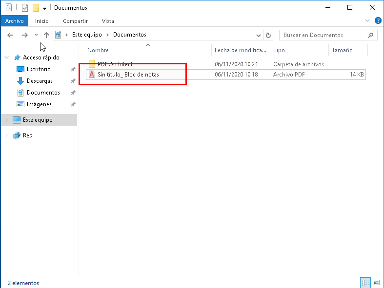

# (2.2) Comprobar que se imprime de forma remota			

Nos dirigimos al cliente y buscamos mediante la IP del servidor en la barra de navegación.

_\\\ip-del-servidor_ :

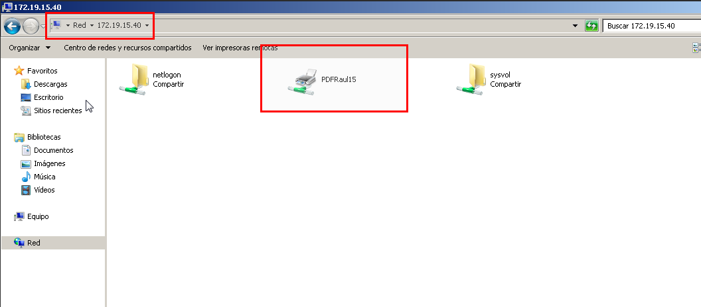

Nos conectaremos a dicha impresora y establecemos el usuario y la clave del servidor. Una vez hecho esto ya tendremos la impresora remota configurada en el cliente, para Comprobar que todo funciona correctamente haremos una prueba de impresión:

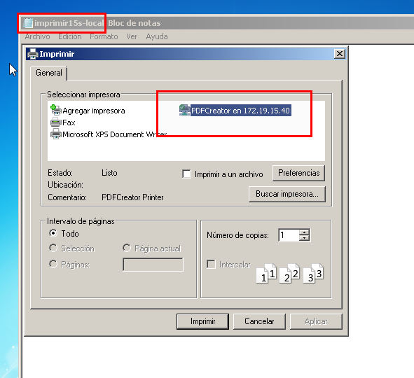

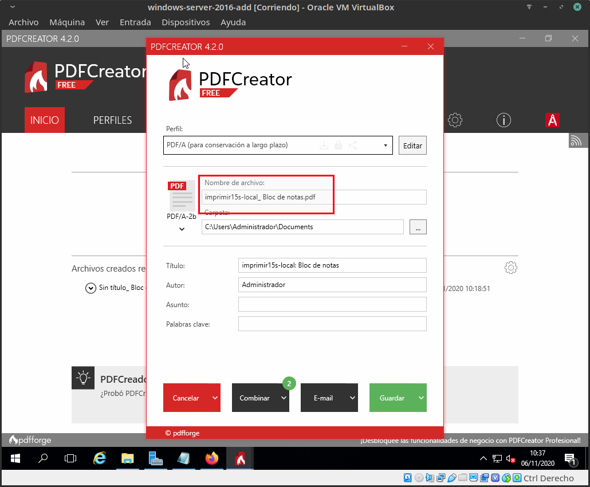

# (3.3) Comprobar que se imprime desde el navegador

Ahora nos conectaremos mediante la IP del servidor(*ip-del-servidor/printers*) mediante el navegador web y establecemos el usuario y la clave del servidor:

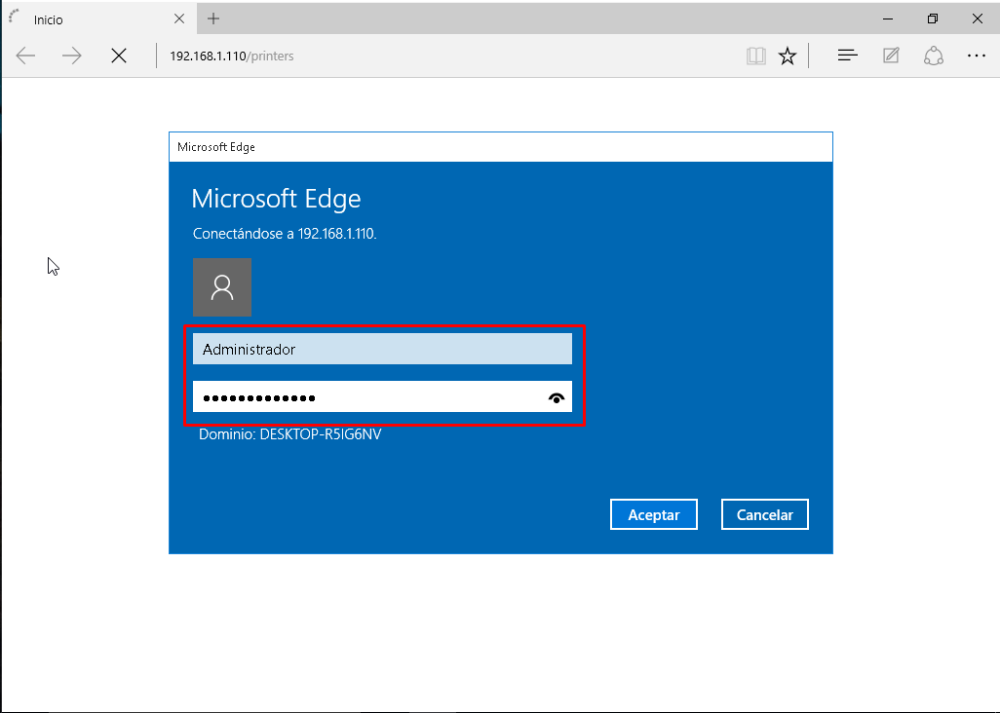

Una vez dentro, nos dirigimos a las _Propiedades_ del servidor y copiaremos el _Nombre de red_:

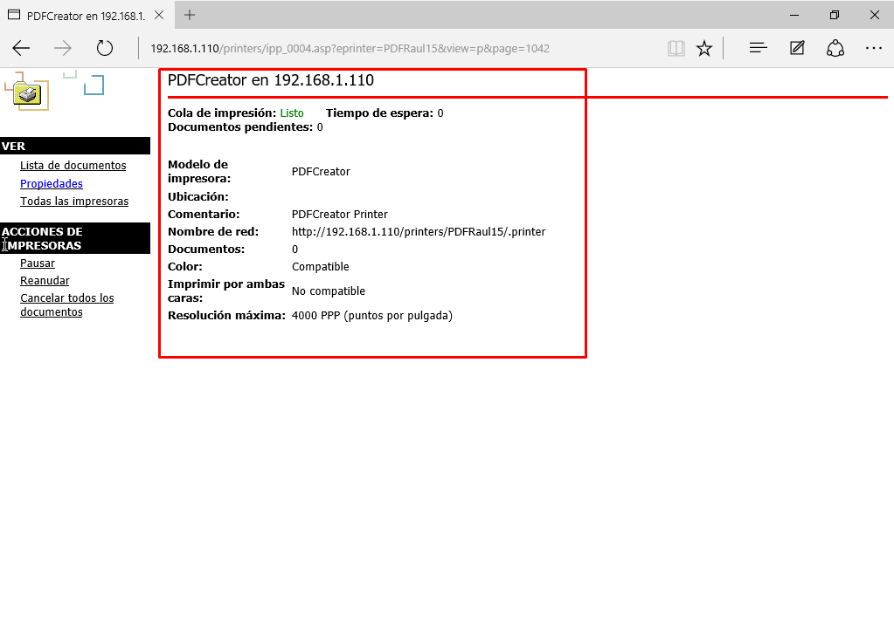
Ahora agregaremos la impresora, para ello nos dirigimos al apartado **Dispositivos e impresoras** y agregaremos una nueva impresora estableciendo el _Nombre de red_:

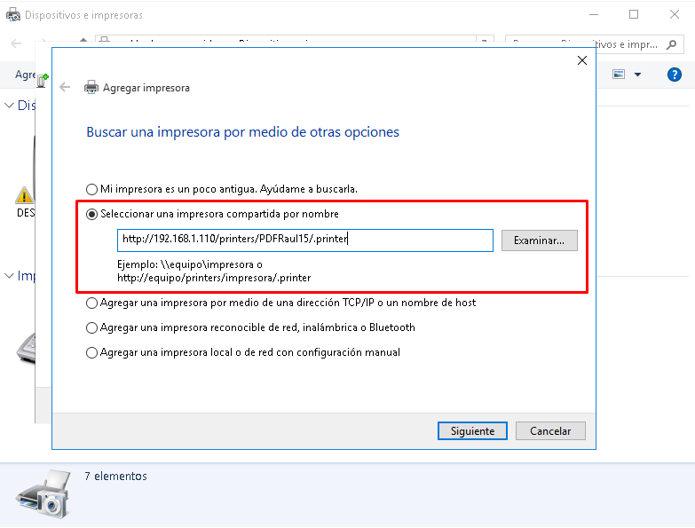

Nos pedirá clave y usuario del servidor:

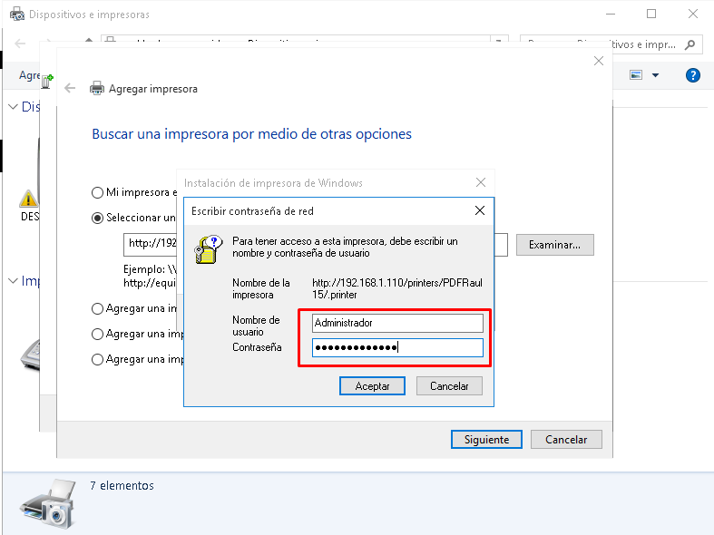

y comprobamos que se ha agregado la impresora:

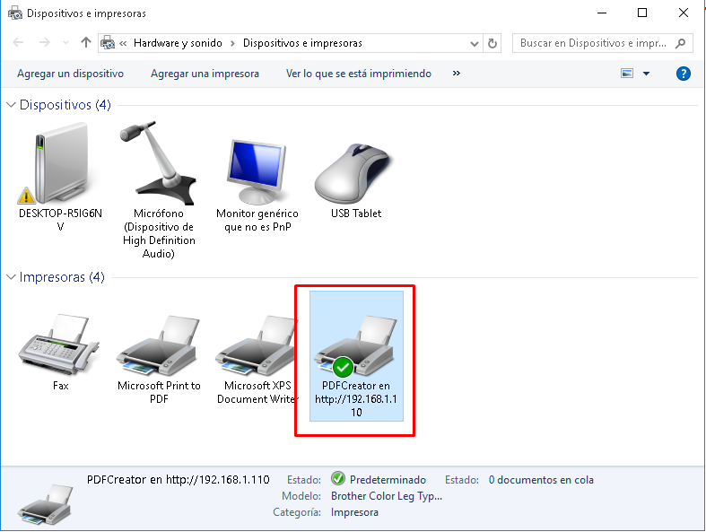

Hacemos una prueba de impresión del fichero _imprimir15w-web_ y comprobamos que todo funciona correctamente, pero antes establecemos la **Cola de impresión** en _Pausa_ y mas adelante lo reanudaremos:

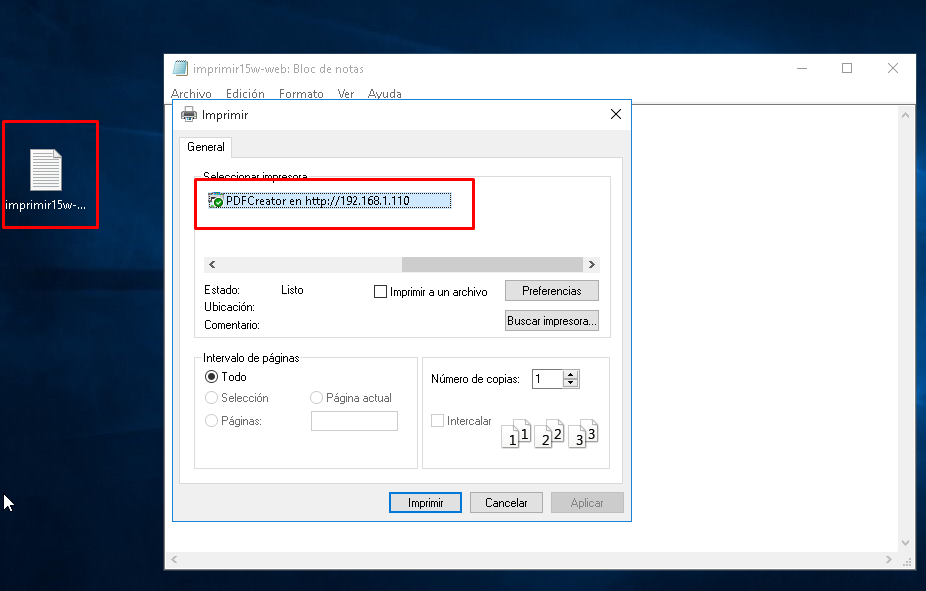

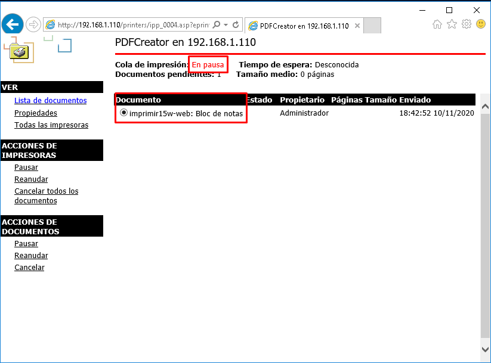

Para finalizar, si nos dirigimos al servidor y reanudamos el la **Cola de impresión**, una vez hecho esto, estará el archivo que hemos intentado imprimir:

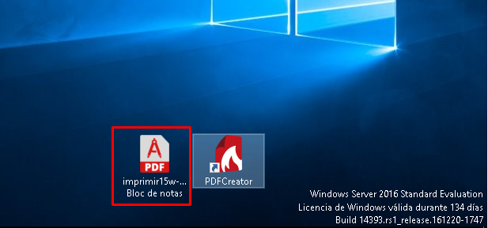
