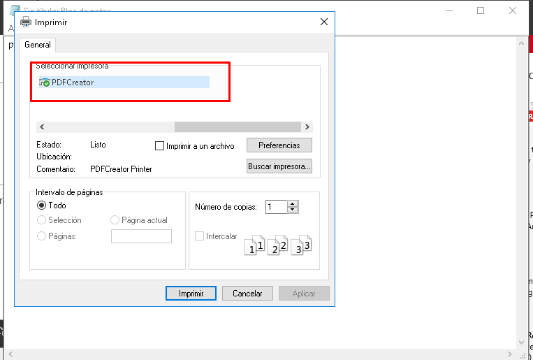

# (1.3) Comprobar que se imprime de forma local		

Probaremos la impresión remota imprimiendo el documento _imprimir15s-local_:

# (2.2) Comprobar que se imprime de forma remota			

# (3.3) Comprobar que se imprime desde el navegador
