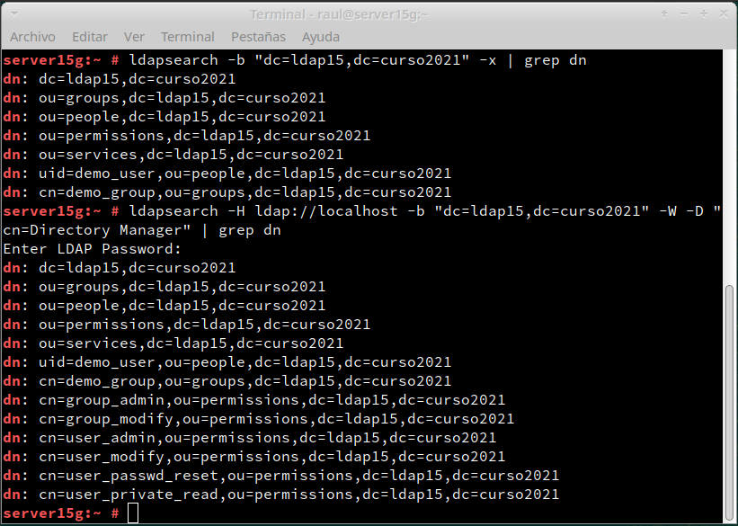
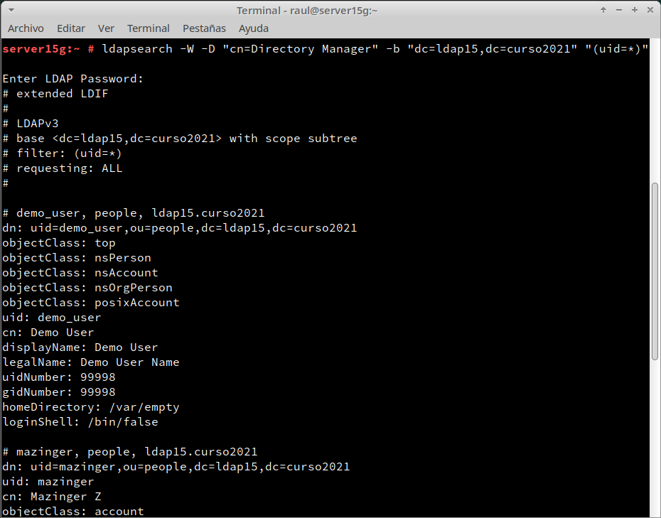
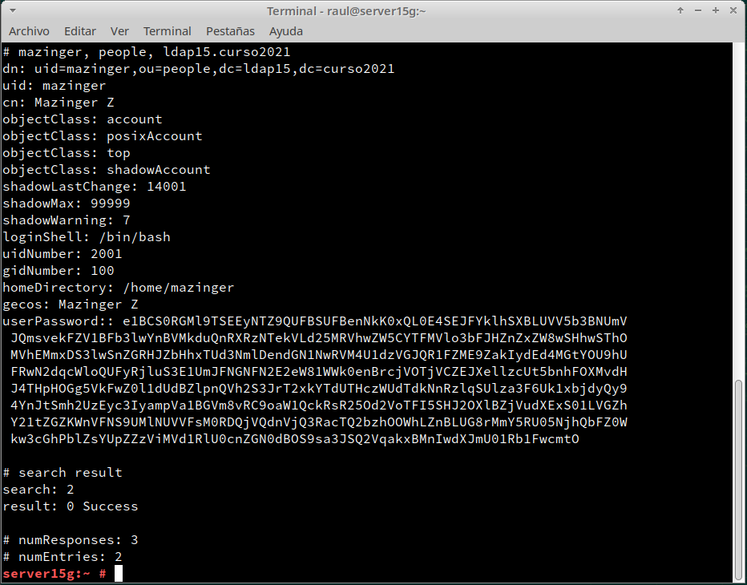
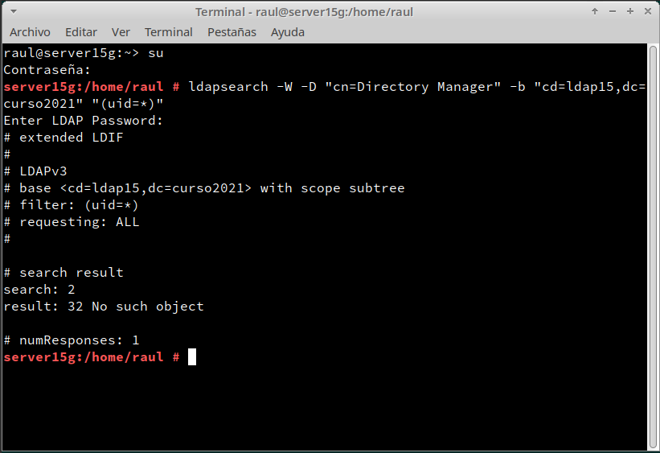
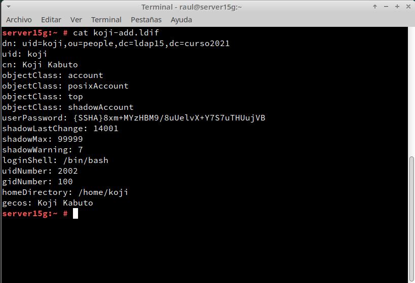
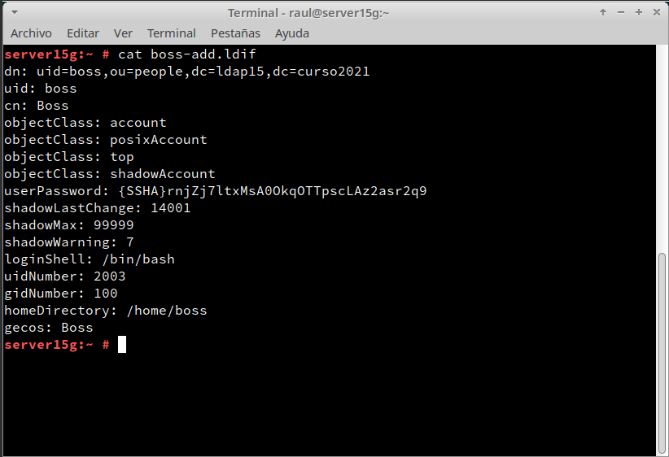
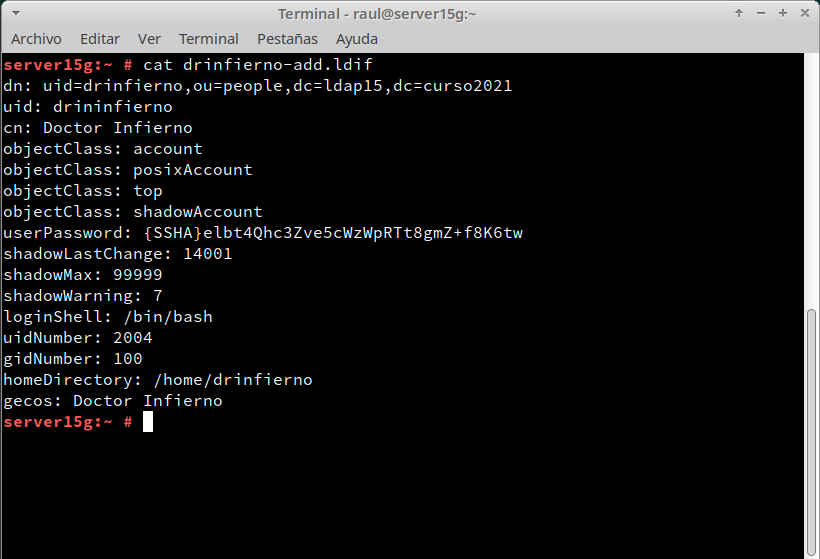
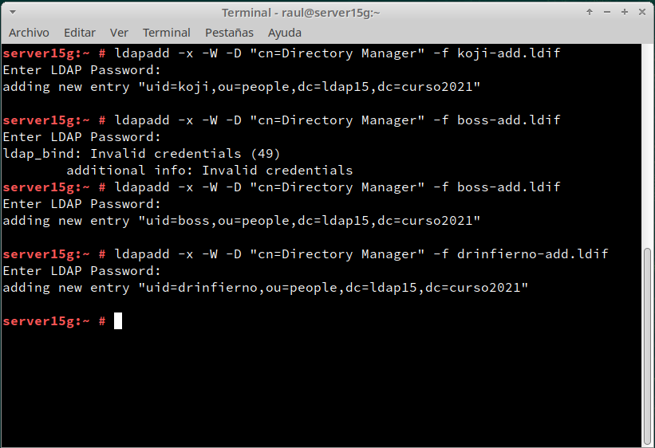
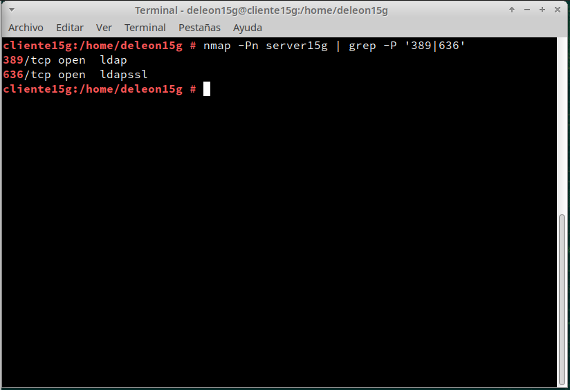
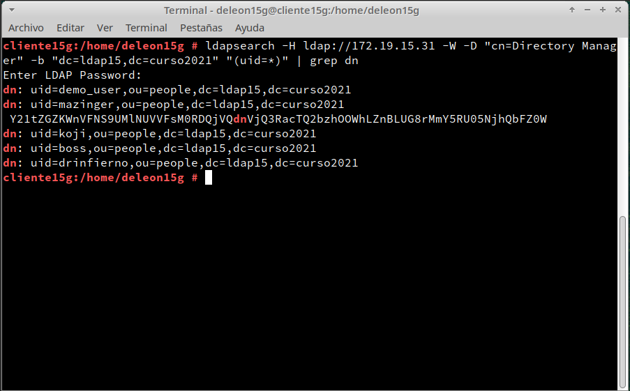

# (2.4) Comprobar contenido del DS LDAP 			

Para mostrar el contenido de nuestra base de datos **LDAP** usamos el comando `ldapsearch -b "dc=ldap15,dc=curso2021" -x | grep dn`:

Ahora haremos la consulta usando usuario/clave de **LDAP** con el comando `ldapsearch -H ldap://localhost -b "dc=ldap15,dc=curso2021" -W -D "cn=Directory Manager" | grep dn`:

# (3.3) Comprobar nuevo usuario 			

A continuación, vamos a listar los usuarios de un directorio, podemos filtrar por `(uid=*)".ldapsearch -W -D "cn=Directory Manager" -b "dc=ldap15,dc=curso2021`:

# (4.3) Comprobar los usuarios creados

Lo siguinte será agregar los usuario al servidor **LDAP**:

 Y escribimos los datos del fichero en el servidor **LDAP** con el comando `ldapadd -x -W -D "cn=Directory Manager" -f (mazinger, boss, koji, drinfierno)-add.ldif`:

Ahora nos dirigimos a la **MV cliente LDAP** y ejecutamos el comando `nmap -Pn 172.19.15.31` para comprobar que el puerto LDAP del servidor está abierto:

Una vez verfiquemos que los puerto están abiertos ejecutamos el comando `ldpasearch -H ldap://172.19.15.31 -W -D "cn=Directory Manager" -b "dc=ldap15,dc=curso2021" "(uid=*)" | grep dn` para consultar los usuarios **LDAP** que tenemos en el servicio de directorio remoto:

