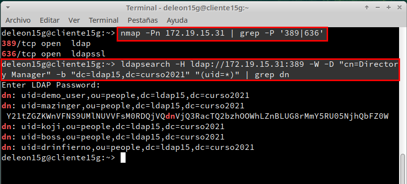
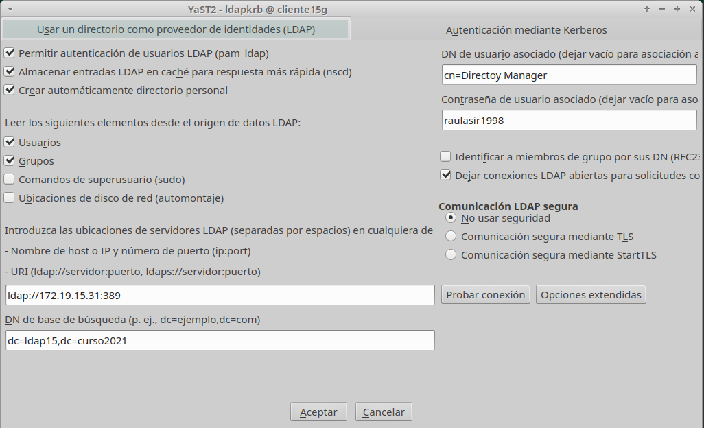
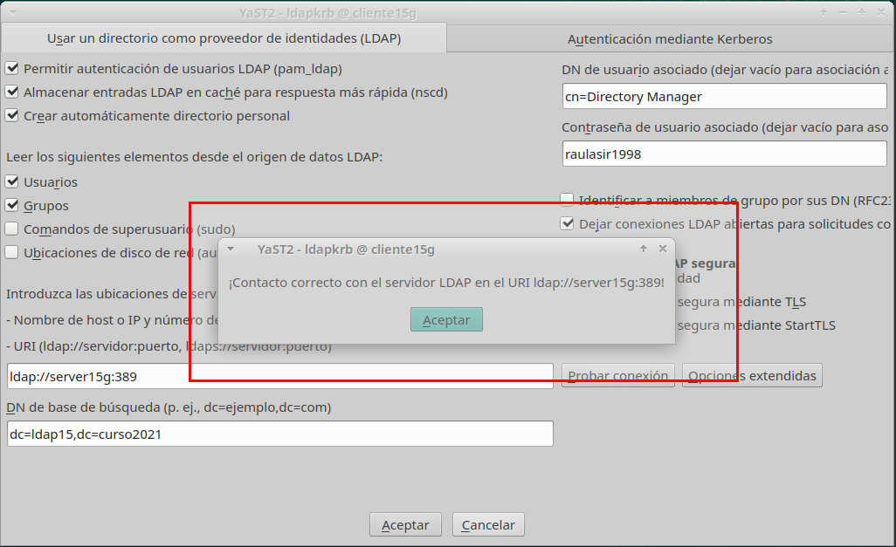
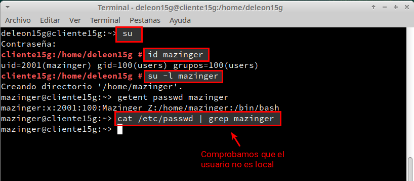

# 1. Preparativos

Comprobamos el acceso al LDAP desde el cliente:

Ir a MV cliente y ejecutar los siguientes comandos:

`nmap -Pn 172.19.15.31 | grep -P '389|636`

 Comprobamos que los usuarios del LDAP remoto son visibles en el cliente:

 `ldapsearch -H ldap://172.19.15.31:389 -W -D "cn=Directory Manager" -b "dc=ldap15,dc=curso2021" "(uid=*)" | grep dn`



# Configurar autenticación LDAP

### 2.1 Crear conexión con servidor

Nos dirigimos a la MV cliente y entramos en `yast -> Cliente LDAP y Kerberos` y Configuraremos con los siguientes datos:



Al finalizar comprobará que funciona correctamente:



### 2.2 Comprobar con comandos

Lo primero será iniciar un terminal con el usuario root y probamos los siguientes comandos:

```
id mazinger <- Visualizar el usuario
su -l mazinger <- Entramos con el usuario definido en LDAP

getent passwd mazinger <- Comprobamos los datos del usuario
cat /etc/passwd | grep mazinger <- El usuario no es local
```


