# (3.3) Comprobar proyecto 1 			

Lo primero será estar dentro de la carpeta **vagrant15-celtics** e iniciar la nueva estancia con el comando `vagrant up`:

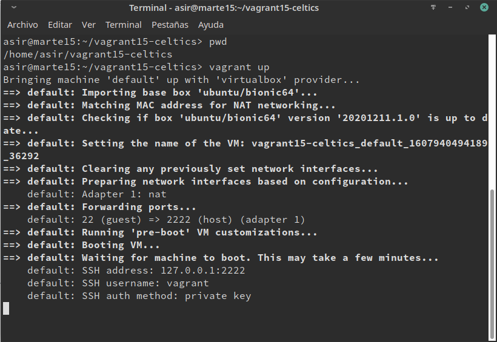

Una vez instalado nos conectaremos mediante **ssh** con el comando `vagrant ssh`:

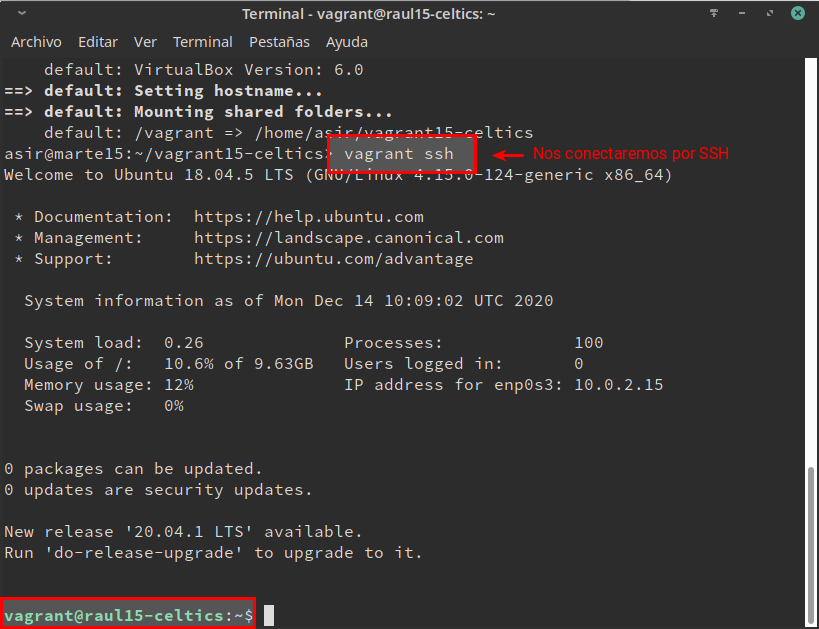

# (5.2) Comprobar proyecto 2 			

Una vez tengamos todo instalado, comprobaremos que el fichero **port** esta configurado correctamente con los siguientes parámetros:

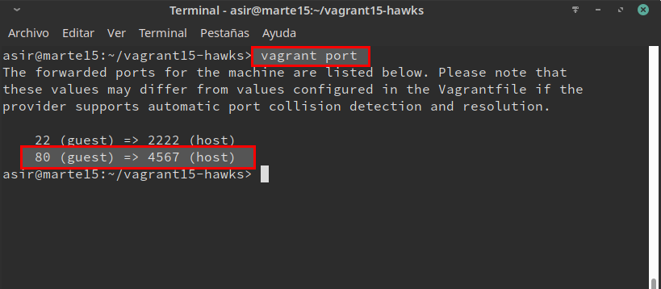

Para verificar que todo funciona correctamente entraremos en el navegador e introduciremos la URL `127.0.0.1:4567`

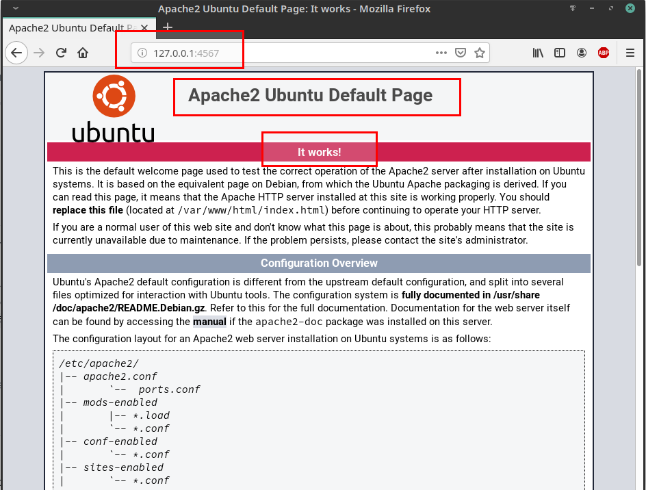


# (6.1) Suministro Shell Script 			

Lo primero será crear todos los ficheros necesarios comenzando por la creación de la carpeta `html` y dentro del mismo crearemos el fichero `index.html` con el contenido:

```
<h1>Proyecto Lakers</h1>
<p>Curso202021</p>
<p>raul15</p>
```

También crearemos el script `install_apache.sh` dentro del proyecto:

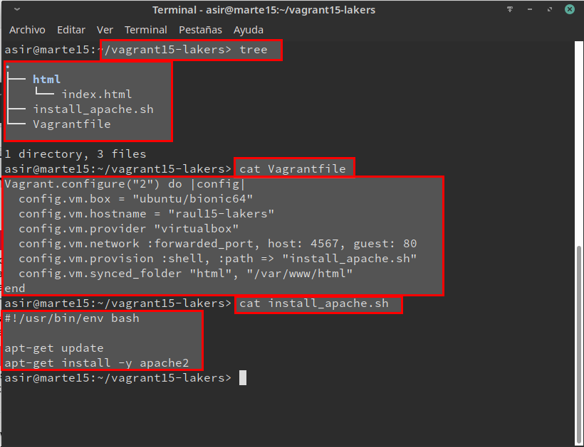

Al instalar la MV con `vagrant up` también se instalará el paquete **Apache**:

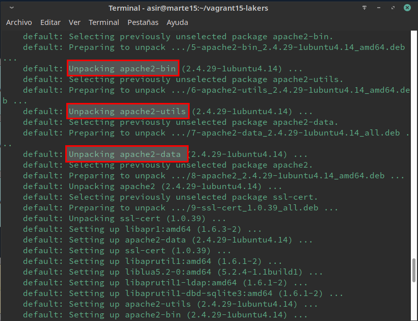

Una vez instalado verificaremos desde el navegador que el servidor Apache se ha instalado mediante la URL `http://127.0.0.1:4567`

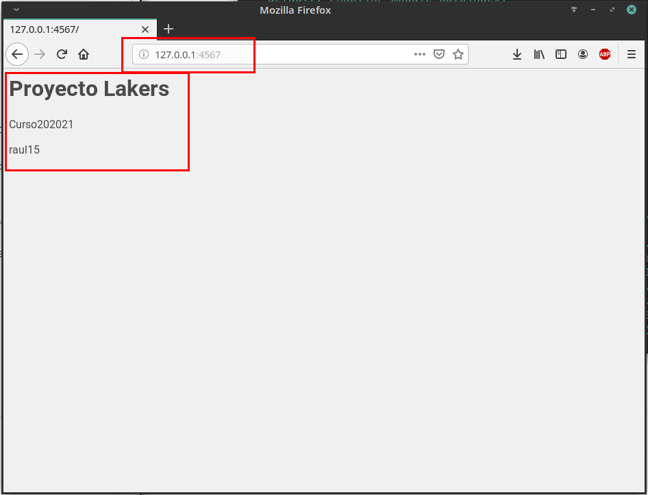


# (6.2) Suministro Puppet 		

Ahora crearemos el directorio `vagrant15-raptors`	y modificaremos el archivo `VagrantFile` con lo siguiente:

```
Vagrant.configure("2") do |config|
  config.vm.box = "ubuntu/bionic64"
  config.vm.hostname = "raul15-raptors"
  config.vm.provider "virtualbox"
  config.vm.network :forwarded_port, host: 4567, guest: 80
  config.vm.provision :shell, :path => "install_apache.sh"
  config.vm.provision "shell", inline: "sudo apt-get update && sudo apt-get install -y puppet"
  config.vm.provision "puppet" do |puppet|
      puppet.manifest_file = "raul15.pp"
    end
end
```

También será necesario crear la carpeta y el fichero `manifests/raul15.pp`

Con las siguientes instrucciones:

```
package { 'geany':
  ensure => 'present',
}
```

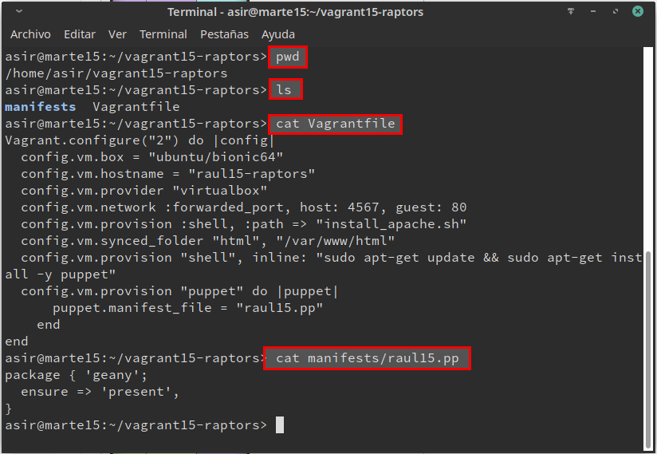

Una vez instalado comprobaremos que la MV funciona correctamente:

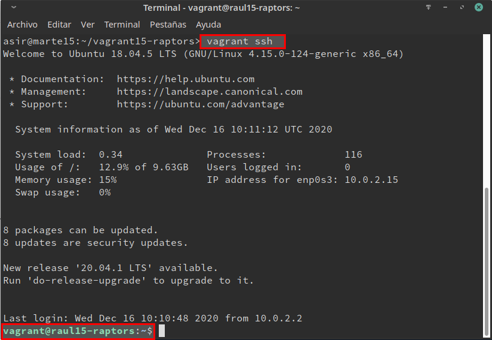

# (7.2) Crear Box Vagrant

Comenzaremos creado la carpeta `vagrant15-bulls`, una vez creada entramos dentro de la carpeta que acabamos de crear y crearemos nuestra propia caja con el comando `vagrant package --base opensuse-smb-cliente --output raul15.box`

Comprobamos que se nos ha creado el fichero raul15.box en el directorio actual:

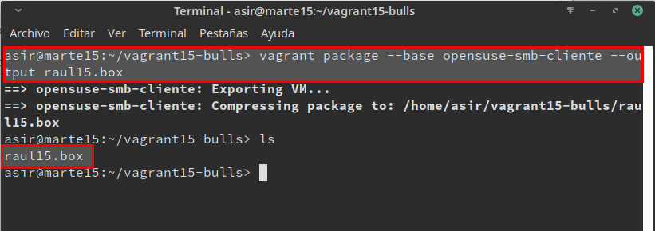

Para finalizar añadimos la nueva caja que hemos creado y los añadimos al repositorio local de cajas de vagrant mediante el comando `vagrant box add raul/bulls raul15.box`

Y mediante el comando `vagrant box list`, consultaremos la cajas vagrant disponibles:

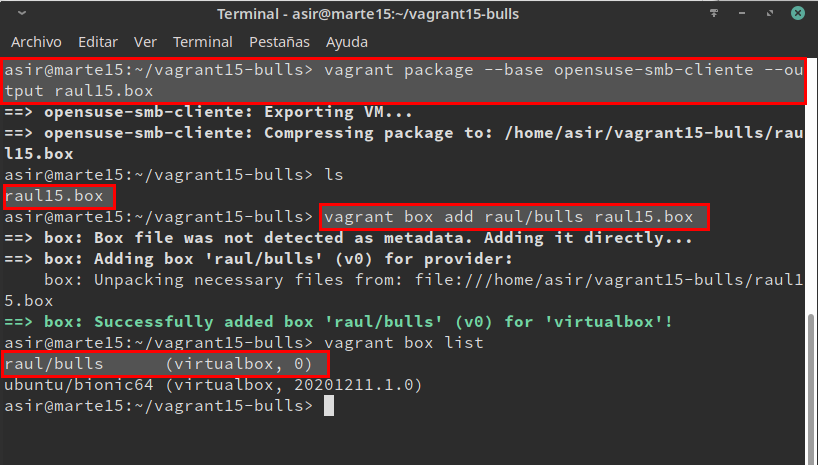
