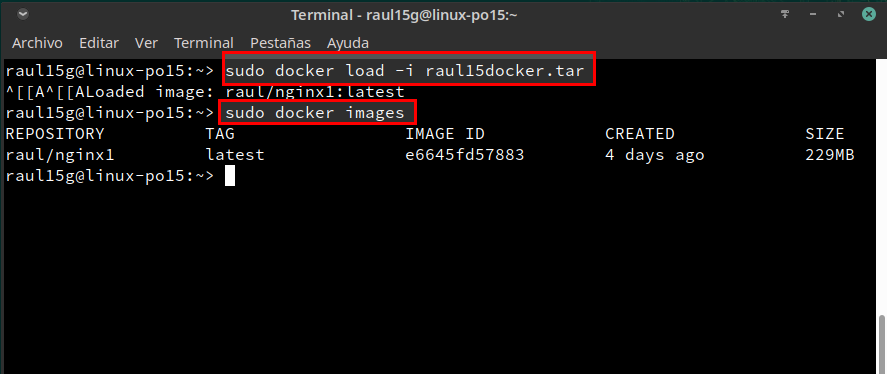

# 3.2	Comprobar			

Abrimos una nueva terminal y ejecutamos el comando `docker ps` el cual nos muestra los contenedores en ejecución:

Una vez comprobado que el contenedor está en ejecución, nos dirigimos al navegador y ponemos la URL `localhost:32768`:

También comprobaremos el acceso a `holamundo1.html`:

Y por último, pararemos y eliminaremos el contenedor:

# 3.3	Migrar la imagen a otra máquina

Exportaremos una imagen Docker a fichero tar:

`docker save -o raul15docker.tar raul/nginx1, guardamos la imagen "raul/nginx1" en un fichero tar`.

Ahora nos llevamos el tar a otra máquina con docker instalado, y restauramos.
`docker load -i raul15docker.tar`, cargamos la imagen docker a partir del fichero tar.

`docker images`, comprobamos que la nueva imagen está disponible.

Probaremos a crear un contenedor (`app3alumno`), a partir de la nueva imagen.

# 4.2	Crear imagen a partir del Dockerfile

Lo primero será crear los ficheros `holamundo2.html` y `Dockerfile` con el siguiente contenido:

Una vez hecho, nos dirigimos a la ubicación de los ficheros y construiremos una nueva imagen a partir del `Dockerfile`:

y comprobamos que funciona correctamente con el comando `docker images`:

# 4.3	Crear contenedor y comprobar

A continuación vamos a crear un contenedor con el nombre app4nginx2, a partir de la imagen raul/nginx2. Probaremos con:

`docker run --name=app4nginx2 -p 8082:80 -t raul/nginx2`

Desde otro terminal:

`docker ps`, para comprobar que el contenedor está en ejecución y en escucha por el puerto deseado.

Comprobar en el navegador:

URL `http://localhost:8082`

URL `http://localhost:8082/holamundo2.html`

# 4.4	Usar imagen de nginx

Crearemos el directorio `docker15b` y crearemos los ficheros `holamundo3.html` y `Dockerfile` con la siguiente información:

Una vez hecho, construiremos la imagen `docker build -t raul/nginx3 .`

Crearemos contenedor, `docker run --name=app5nginx3 -d -p 8083:80 raul/nginx3` y comprobaremos el acceso a `"holamundo3.html"`.

# 5 Docker Hub - Holamundo

Crearemos el directorio `docker15c` y crearemos los ficheros `holamundo15.sh` y `Dockerfile` con la siguiente información:

Una vez hecho, construiremos la imagen `docker build -t raul/holamundo .`

Crearemos contenedor, `docker run raul/holamundo`.

Ahora subiremos la imagen a Docker Hub:

Lo primero será registrarse en Docker Hub, una vez hecho ejecutaremos el comando `docker login -u raulasir15`, para abrir la conexión.

`docker tag raul/holamundo:latest raulasir15/holamundo:version1`, etiquetamos la imagen con `"version1"`.

`docker push raulasir15/holamundo:version1`, para subir la imagen `(version1)` a los repositorios de Docker.

