# 3.4 	Comprobar la conectividad

Desde el Máster comprobamos:

1. Conectividad hacia los Minions.

```
# salt '*' test.ping
minion15g:
    True
```

2. Versión de Salt instalada en los Minions

```
# salt '*' test.version
minion15g:
    3000
```

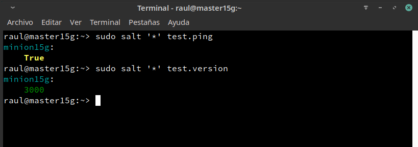

# 4.5 	Aplicar estado (apache) 		

Ir al Master:
* Consultar los estados en detalle y verificar que no hay errores en las definiciones.
    * `salt '*' state.show_lowstate`

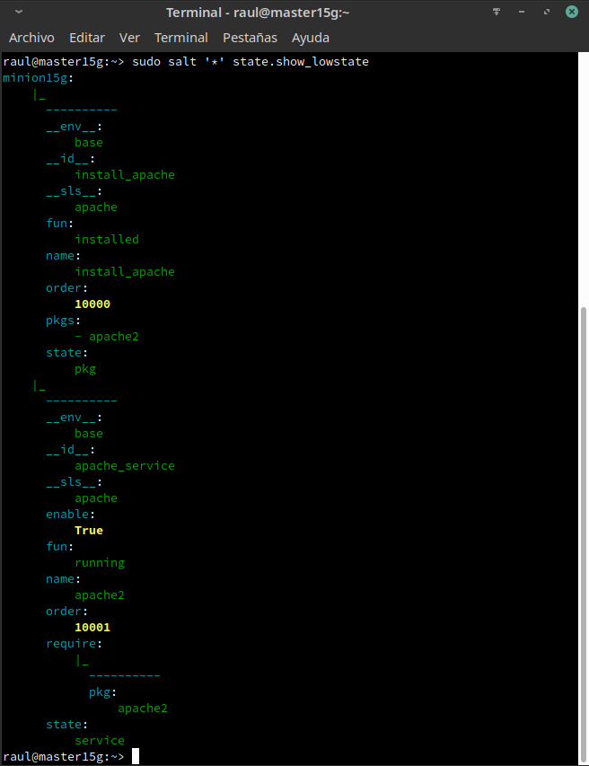
    
* `salt '*' state.show_highstate`,

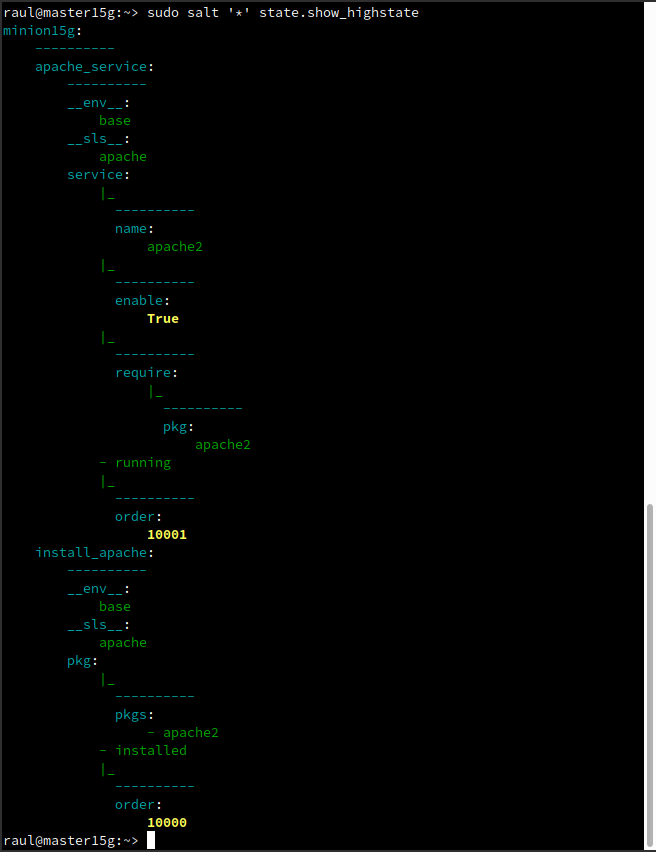

* `salt '*' state.apply apache`

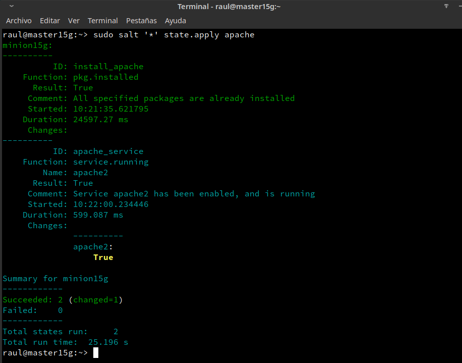
	
# 5.1 	Aplicar estado (users) 			

Vamos a crear un estado llamado users que nos servirá para crear un grupo y usuarios en las máquinas Minions.

Lo primero será crear el directorio `/srv/salt/base/users`.
Dentro del mismo crearemos el fichero `/srv/salt/base/users/init.sls` con los siguientes datos:

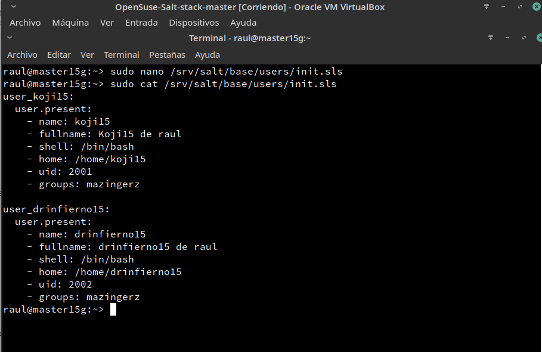

Y aplicamos el estado:

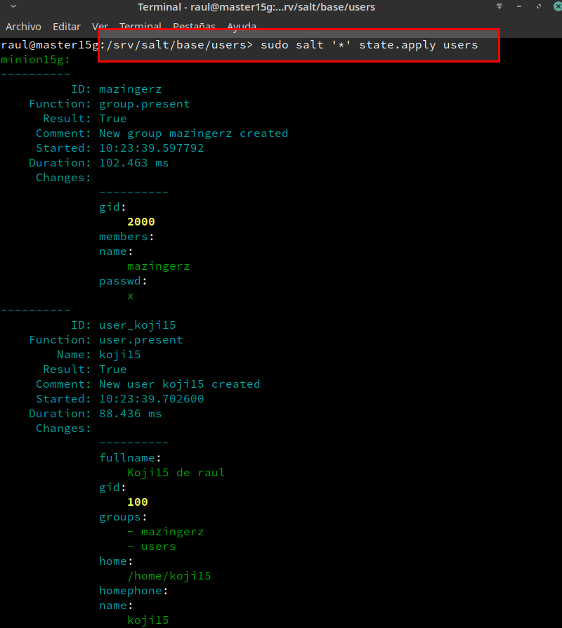

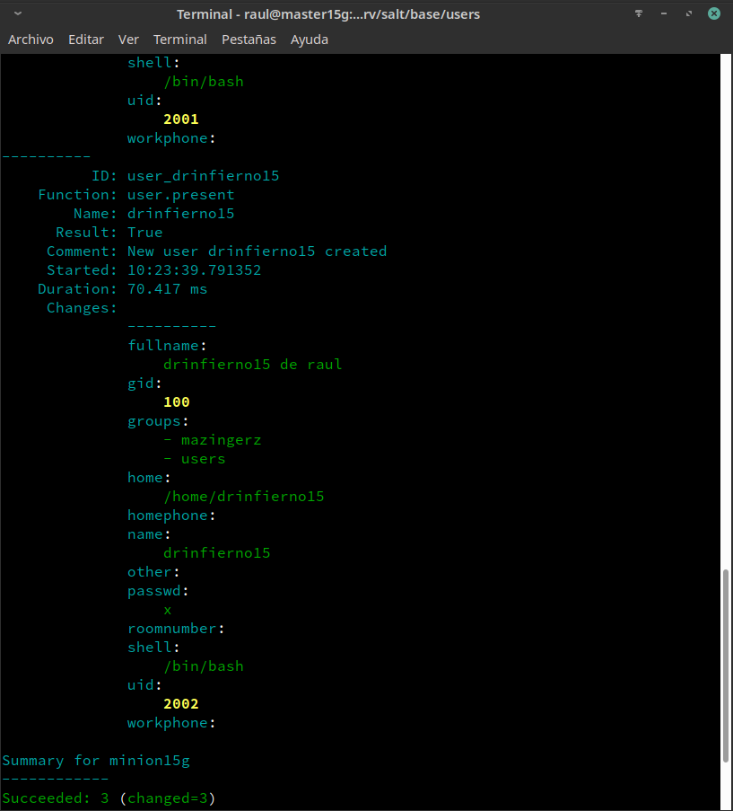

# 5.2 	Aplicar estado (files) 	

Ahora crearemos el estado `dirs` para crear las carpetas `private` (700), `public` (755) y `group` (750) en el **HOME** del usuario `koji`:

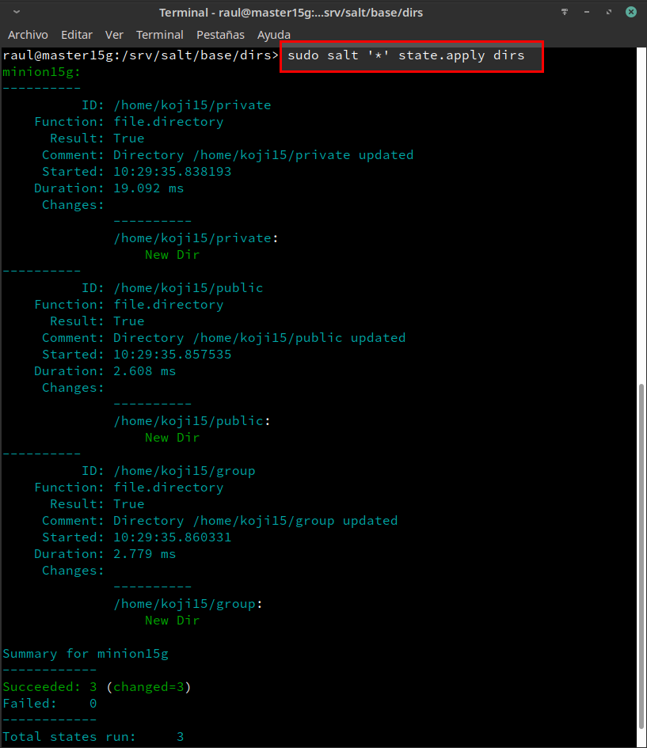
		
5.3 Ampliar estado "apache"

* Para finalizar, modificaremos el estado apache añadiendo la siguiente linea:

```
holamundo:
  file.managed:
    - name: /srv/www/htdocs/holamundo.html
    - source: salt://files/holamundo.html
```

* Por último, crearemos el fichero `/srv/salt/base/files/holamundo.html` y dentro escribiremos el nombre del alumno y la fecha actual.

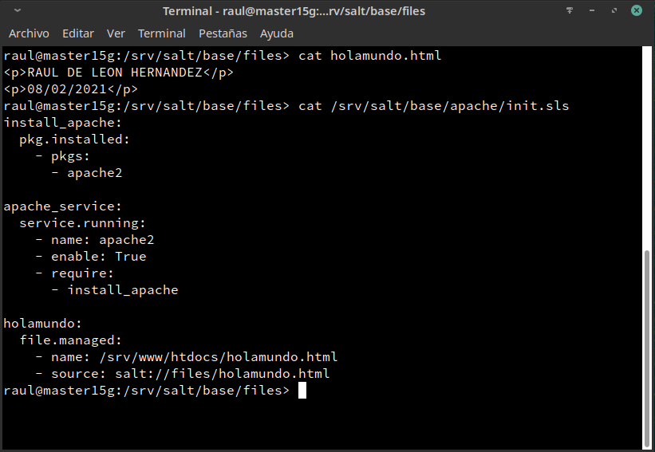

Una vez hecho, aplicaremos el estado **apache**:

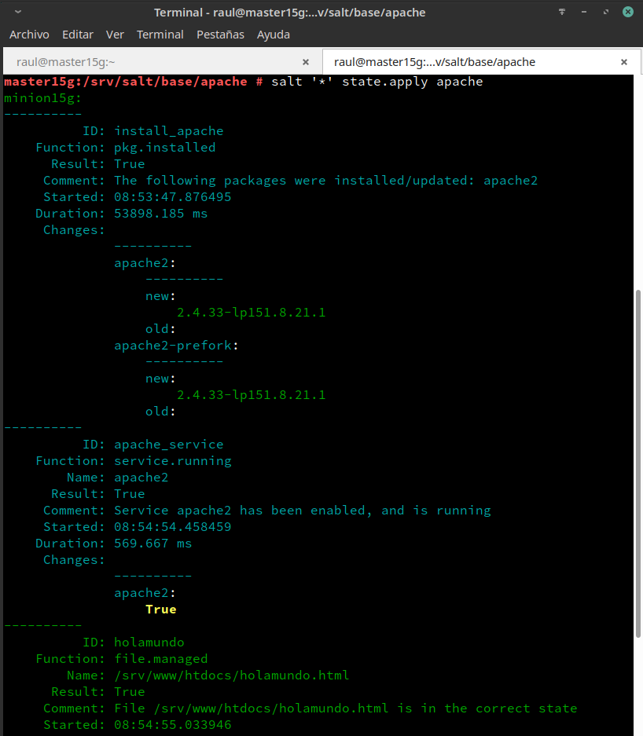

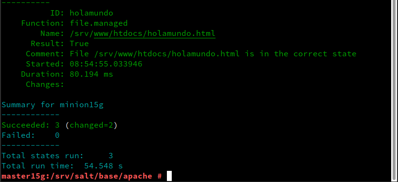
